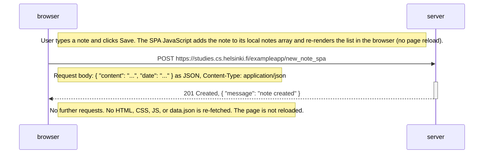

```mermaid
sequenceDiagram
    participant browser
    participant server

    Note right of browser: User types a note and clicks Save. The SPA JavaScript adds the note to its local notes array and re-renders the list in the browser (no page reload).

    browser->>server: POST https://studies.cs.helsinki.fi/exampleapp/new_note_spa
    Note right of browser: Request body: { "content": "...", "date": "..." } as JSON, Content-Type: application/json
    activate server
    server-->>browser: 201 Created, { "message": "note created" }
    deactivate server

    Note right of browser: No further requests. No HTML, CSS, JS, or data.json is re-fetched. The page is not reloaded.
```
